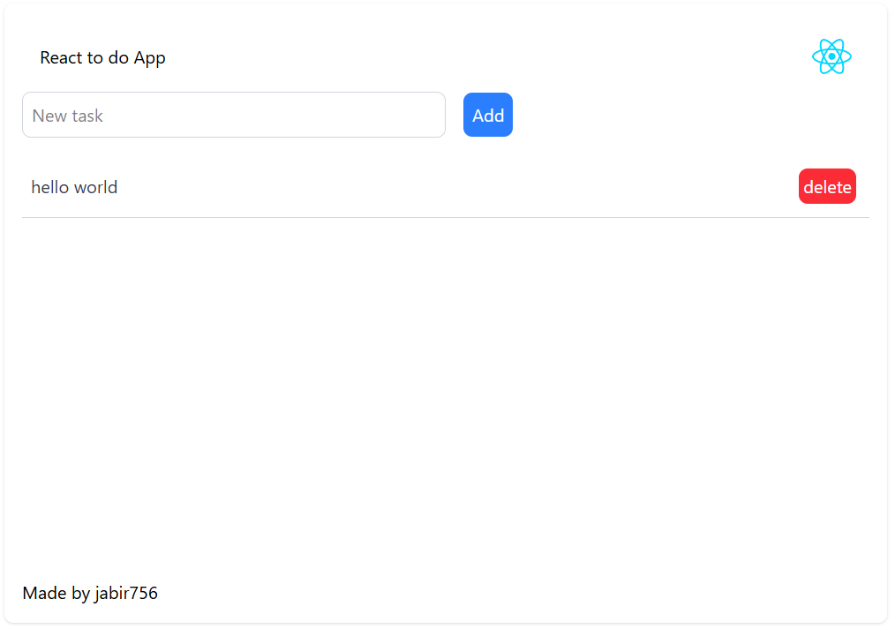

# To-Do List Application

This is a simple To-Do List application built with React and Vite. It allows users to add and delete tasks, with the tasks being stored in the browser's local storage.



## Features

- Add new tasks
- Delete existing tasks
- Tasks are stored in local storage
- Responsive design with Tailwind CSS

## Technologies Used

- React
- Vite
- Tailwind CSS
- ESLint

## Getting Started

### Prerequisites

- Node.js (version 14 or higher)
- npm (version 6 or higher)

### Installation

1. Clone the repository:
    ```sh
    git clone https://github.com/jabir756/to-do-list.git
    ```
2. Navigate to the project directory:
    ```sh
    cd to-do-list
    ```
3. Install the dependencies:
    ```sh
    npm install
    ```

### Running the Application

To start the development server, run:
```sh
npm run dev
```
The application will be available at `http://localhost:3000`.

### Building the Application

To build the application for production, run:
```sh
npm run build
```
The built files will be in the `dist` directory.

### Linting the Code

To lint the code, run:
```sh
npm run lint
```

## License

This project is licensed under the MIT License.

## Author

Made by jabir756